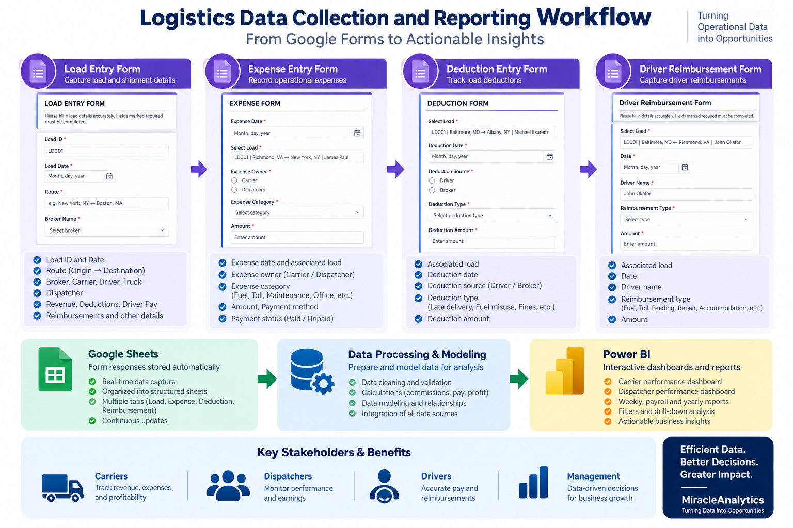
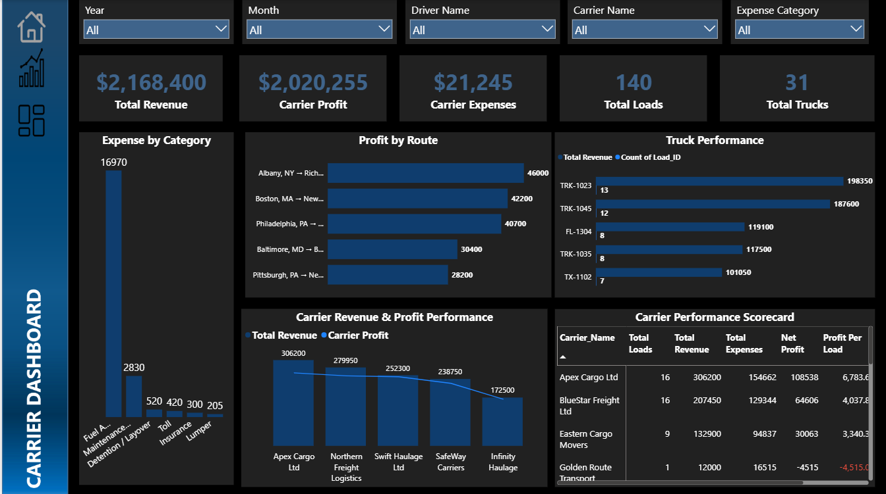
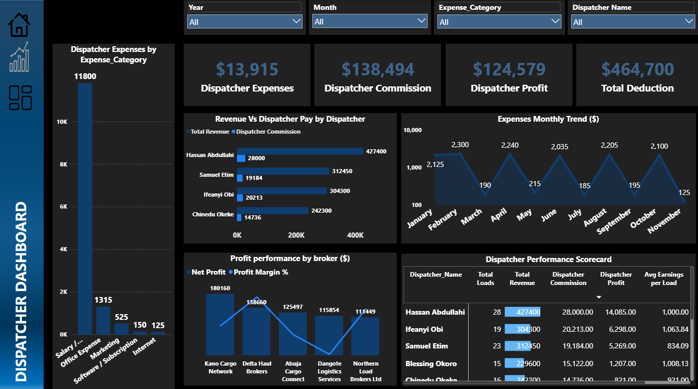
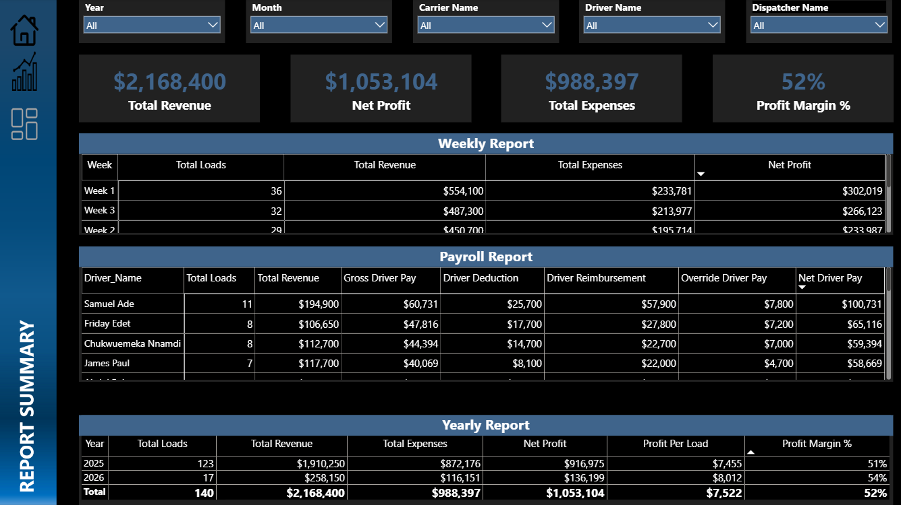

# Logistics Management & Performance Reporting System

**Google Forms | Google Sheets | Microsoft Power BI | Power Query | DAX**

An end-to-end logistics reporting solution designed during my internship at **Darl Dispatch and Transport Company** to improve operational data collection, centralize logistics records, and provide interactive performance reporting for management.

---

## 🔎 Project Overview

The project was designed to provide a structured way to collect, organize, and analyze logistics and operational data across loads, expenses, deductions, reimbursements, dispatcher activities, carrier performance, payroll, revenue, and profitability.

The solution integrates:

**Google Forms → Google Sheets → Data Processing & Modeling → Power BI**

This workflow transforms operational data into centralized reports that support performance monitoring and decision-making.

---

## 🎯 Business Problem

The logistics operation required a more organized approach to tracking operational and financial activities while producing reliable periodic reports.

Key reporting requirements included:

- Load and shipment tracking
- Operational expense monitoring
- Driver deductions and reimbursements
- Dispatcher commissions and performance
- Carrier performance and profitability
- Payroll reporting
- Weekly and yearly operational reporting

The objective was to move away from fragmented manual processes toward a centralized reporting workflow.

---

## ⚙️ Solution

I designed four standardized Google Forms to capture the major operational processes:

| Form | Purpose |
| --- | --- |
| **Load Entry Form** | Captures load, route, broker, carrier, driver, revenue, deductions, pay, and related information |
| **Expense Entry Form** | Captures operational expenses, categories, payment details, and associated loads |
| **Deduction Entry Form** | Captures deductions, dates, sources, types, and amounts |
| **Driver Reimbursement Form** | Captures driver reimbursement activity, dates, types, and amounts |

Form responses were centralized in Google Sheets before being prepared and modeled for Power BI reporting.

---

## 🔒 Data & Privacy

The data included in this portfolio project is **synthetic operational data created for demonstration and analysis**.

Although the solution was developed during my internship at Darl Dispatch and Transport Company, **no confidential company, client, driver, or financial records are included in this repository**.

---

## 📊 Power BI Reporting

The Power BI solution contains three primary reporting pages.

### 🚚 Carrier Dashboard

Provides visibility into carrier-level performance through:

- Revenue and carrier profit
- Expenses
- Load and truck activity
- Route performance
- Truck performance
- Carrier scorecards

### 👤 Dispatcher Dashboard

Provides visibility into dispatcher-level performance through:

- Dispatcher expenses
- Dispatcher commissions
- Dispatcher profit
- Deductions
- Revenue versus dispatcher pay
- Monthly expenses
- Broker profitability
- Dispatcher scorecards

### 📋 Report Summary

Provides consolidated reporting for:

- Weekly operations
- Payroll
- Yearly performance
- Revenue and operational KPIs
- Management summaries

---

## 🛠️ Technical Implementation

### Data Preparation

**Power Query** was used to prepare and transform the operational datasets covering:

- Load data
- Expense data
- Deduction data
- Reimbursement data

The datasets were structured to support reliable relationships and consistent reporting across the different operational processes.

### DAX & Analytics

DAX measures were developed for:

- Driver payroll calculations
- Dispatcher commissions
- Revenue analysis
- Expense analysis
- Profitability analysis
- Operational KPIs
- Performance reporting

### Dashboard Design

The report incorporates:

- KPI cards
- Slicers
- Scorecards
- Interactive filtering
- Comparative performance views

The dashboards were designed around different reporting needs, including carrier performance, dispatcher performance, payroll, and consolidated operational reporting.

---

## 💼 Business Value

The solution provides a centralized approach to logistics reporting and improves visibility across key operational areas.

Key benefits include:

- Structured operational data collection
- Centralized logistics information
- Improved monitoring of loads, expenses, deductions, and reimbursements
- Better visibility into dispatcher and carrier performance
- More organized payroll and periodic reporting
- Faster access to operational information
- Better support for management decision-making

---

## ⚠️ Key Challenge

A major technical challenge was integrating multiple operational processes while maintaining reliable relationships between load, expense, deduction, and reimbursement datasets.

This required careful attention to data structure, transformation, relationships, and DAX calculations to ensure consistent reporting across the Power BI solution.

---

## 🧠 Skills Demonstrated

**Business Intelligence:** Microsoft Power BI, dashboard development, KPI reporting, operational reporting

**Data Preparation:** Power Query, data transformation, structured data preparation

**Analytics:** Revenue, expenses, profitability, payroll, dispatcher, carrier, and operational performance analysis

**DAX:** Calculated measures, commissions, payroll calculations, profitability metrics, operational KPIs

**Data Workflow Design:** Google Forms, Google Sheets, centralized data collection, reporting integration

**Business Problem Solving:** Translating operational requirements into a structured reporting and decision-support solution

---

## 📁 Repository Structure

<pre>
logistics-management-performance-reporting/
│
├── README.md
│
├── assets/
│   ├── 01-carrier-dashboard.png
│   ├── 02-dispatcher-dashboard.png
│   ├── 03-report-summary.png
│   └── 04-data-collection-workflow.png
│
├── data/
│   ├── load_data.csv
│   ├── expense_data.csv
│   ├── deduction_data.csv
│   └── reimbursement_data.csv
│
├── power-bi/
│   └── Logistics Management Performance Reporting.pbix
│
└── documentation/
</pre>

---

## 🎯 Project Focus

**Domain:** Logistics & Transportation

**Project Type:** Business Intelligence / Operational Reporting

**Data:** Synthetic operational data

**Primary Tools:** Google Forms, Google Sheets, Power BI, Power Query, DAX

**Reporting Areas:** Loads, Expenses, Payroll, Dispatchers, Carriers, Revenue & Profitability

---

## Disclaimer

This project is presented as a portfolio demonstration of a logistics management and reporting solution developed during an internship. The data included in this repository is synthetic and was created for demonstration purposes only.